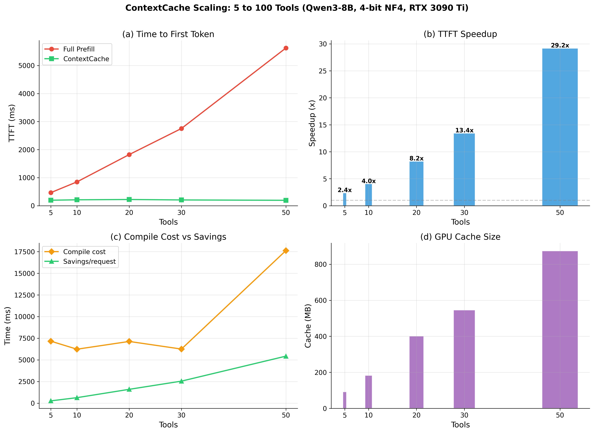

# ContextCache

**Skip 99% of tool tokens. TTFT stays flat at 200ms.**

ContextCache is an open-source middleware that caches the KV states of tool definitions so they don't get recomputed on every request. Register your tools once, reuse the cached KV across all users, sessions, and requests.



| Tools | Full Prefill | Cached | Speedup | Tokens Skipped | Saved @10K req/day |
|------:|-------------:|-------:|--------:|---------------:|-------------------:|
|     5 |       466 ms | 196 ms |    2.4x |      651 (89%) |               6.5M |
|    10 |       850 ms | 210 ms |    4.0x |    1,303 (94%) |              13.0M |
|    20 |     1,823 ms | 221 ms |    8.2x |    2,854 (97%) |              28.5M |
|    30 |     2,754 ms | 205 ms |   13.4x |    3,884 (98%) |              38.8M |
|    50 |     5,625 ms | 193 ms |   29.2x |    6,215 (99%) |              62.1M |

*Qwen3-8B | 4-bit NF4 | RTX 3090 Ti | 15 queries per size*

## Why?

Every tool-calling LLM request sends the full tool schemas through prefill. With 50 tools that's ~6,000 tokens reprocessed on every single request, for every user, even though the tools never change.

ContextCache compiles those tool schemas into a KV cache **once**, stores it on disk, and reuses it across all requests. Only the user query (a few tokens) goes through prefill. The result: **constant ~200ms TTFT regardless of how many tools you have.**

## Quick Start

```bash
git clone https://github.com/spranab/contextcache.git
cd contextcache

# Demo mode (no GPU needed)
./start.sh

# Live mode (requires GPU with ~8GB VRAM)
./start.sh --live
```

Open http://localhost:8421 for the browser dashboard.

### Python SDK

```bash
pip install contextcache
```

```python
from contextcache import ContextCacheClient

client = ContextCacheClient("http://localhost:8421", api_key="your-key")

# Register tools (compiles KV cache — one time cost)
client.register_tools("merchant", tools=[
    {"type": "function", "function": {"name": "gmv_summary", ...}},
    {"type": "function", "function": {"name": "track_order", ...}},
    # ... up to 100+ tools
])

# Route queries — cache hit, ~200ms regardless of tool count
result = client.route("merchant", "What's my GMV for last 30 days?")
print(result.tool_name)    # "gmv_summary"
print(result.arguments)    # {"time_period": "last_30_days"}
print(result.confidence)   # 1.0

# Full pipeline: route → execute → call Claude/GPT for final answer
result = client.pipeline(
    "merchant", "What's my GMV?",
    llm_format="claude",
    llm_api_key="sk-ant-...",
)
print(result.llm_response)  # "Your GMV for the last 30 days is $1.2M..."
```

### Server-Side LLM Credentials

Keep API keys off the wire — configure once on the server:

```bash
python scripts/serve/serve_context_cache.py --llm-config configs/llm_config.json
```

```python
# Or configure via API
client.configure_llm("merchant", provider="claude", api_key="sk-ant-...")

# Now pipeline calls don't need API keys
result = client.pipeline("merchant", "What's my GMV?")
print(result.llm_response)  # Claude answers automatically
```

## How It Works

```
Tool Schemas (JSON) ──→ SHA-256 hash ──→ Group KV Compilation
                                              │
                                         Store to disk (.pt files)
                                              │
Request: "What's my GMV?" ──→ Load cached KV ──→ Suffix-only prefill ──→ Tool selection
                                                     (only user query)
```

**Group caching**: System prompt + all tool definitions are compiled together into a single KV cache blob, keyed by SHA-256 hash of the sorted schemas. On cache hit, only the user query suffix goes through the model.

**Content-addressed storage**: Identical tool sets across tenants share the same cache automatically. No duplicate computation, no duplicate storage.

**Why not per-tool caching?** Per-tool independent KV compilation fails (TSA ~0.1) because tool tokens need cross-attention to the system prompt and each other during prefill. Group caching preserves these dependencies and matches full prefill quality exactly.

### Quality: Zero Degradation

| Split | Condition | TSA | PF1 | EM |
|-------|-----------|-----|-----|----|
| test_seen | group_cached | **0.850** | 0.735 | 0.600 |
| test_seen | full_prefill | 0.850 | 0.716 | 0.550 |
| test_held_out | group_cached | **0.900** | 0.694 | 0.600 |
| test_held_out | full_prefill | 0.900 | 0.694 | 0.600 |
| test_unseen | group_cached | **0.850** | 0.676 | 0.550 |
| test_unseen | full_prefill | 0.850 | 0.676 | 0.550 |

Group-cached matches full prefill **exactly** on TSA across all 3 splits.

## API Reference

### V2 Endpoints (Multi-Tenant)

| Endpoint | Method | Description |
|----------|--------|-------------|
| `/v2/tools` | POST | Register a named tool set (tool_id) |
| `/route` | POST | Route query → tool selection with confidence |
| `/v2/pipeline` | POST | Full pipeline: route → execute → format → LLM call |
| `/v2/registry` | GET | List all registered tool sets |
| `/v2/tools/{tool_id}` | DELETE | Remove a tool set |

### V1 Endpoints (Single-Tenant, Backward Compatible)

| Endpoint | Method | Description |
|----------|--------|-------------|
| `/tools` | POST | Register tool schemas |
| `/query` | POST | Query with cached context |
| `/query/compare` | POST | A/B: cached vs full prefill |
| `/status` | GET | Cache stats |
| `/health` | GET | Health check |

### Admin Endpoints

| Endpoint | Method | Description |
|----------|--------|-------------|
| `/admin/llm-config/{tool_id}` | POST | Set server-side LLM credentials |
| `/admin/llm-config` | GET | List LLM configs (keys masked) |
| `/admin/metrics` | GET | Per-key request metrics |
| `/admin/memory` | GET | GPU cache memory status |
| `/admin/evict` | POST | Force LRU eviction |

## Architecture

```
contextcache/
  context_cache/                     # Core package
    context_cache.py                 # KV cache engine (compile, link, execute)
    client.py                        # Python SDK (ContextCacheClient)
    llm_adapter.py                   # Claude/OpenAI adapters (enterprise gateway support)
    llm_config.py                    # Server-side LLM credential management
    middleware.py                    # Auth, rate limiting, metrics
    memory_manager.py                # GPU memory tracking, LRU eviction
    cache_config.py                  # Configuration dataclasses
    kv_store.py                      # Persistent hash-addressed KV store
    model_adapter.py                 # Model-agnostic adapter (Qwen, Llama, etc.)
    rope_utils.py                    # RoPE math utilities
  scripts/
    serve/serve_context_cache.py     # FastAPI server
    serve/static/index.html          # Browser dashboard
    eval/test_accuracy.py            # Routing accuracy benchmark
    cache/benchmark_scaling_100.py   # Scaling benchmark (5→100 tools)
    analysis/scaling_charts.py       # Generate charts
  tests/                             # 130 unit tests
  configs/
    context_cache_config.yaml        # Model & cache config
    llm_config.example.json          # Example server-side LLM config
```

## Benchmarks

```bash
# Scaling benchmark (requires CUDA GPU)
python scripts/cache/benchmark_scaling_100.py

# Routing accuracy test
python scripts/eval/test_accuracy.py --num-tools 50

# Unit tests (no GPU needed)
pip install -e ".[dev]"
pytest tests/ -v
```

## Enterprise Features

- **Multi-tenant**: Multiple tool sets with independent caches, LRU eviction
- **LLM Pipeline**: Route → execute → call Claude/OpenAI for final answer
- **Enterprise gateways**: Custom `base_url` + `extra_headers` for Azure OpenAI, internal proxies, etc.
- **Server-side credentials**: API keys stored on server, never sent in requests
- **Auth & rate limiting**: API key validation, per-key sliding window rate limits
- **Metrics**: Per-key request counts, latencies, cache hit rates
- **Persistent cache**: Disk-backed KV store survives server restarts

## Paper

**ContextCache: Persistent KV Cache with Content-Hash Addressing for Zero-Degradation Tool Schema Caching**
Pranab Sarkar, 2026

Paper PDF: [paper/main.pdf](paper/main.pdf)

[](https://doi.org/10.5281/zenodo.18795189)

## Citation

```bibtex
@techreport{sarkar2026contextcache,
  title={ContextCache: Persistent {KV} Cache with Content-Hash Addressing for Zero-Degradation Tool Schema Caching},
  author={Sarkar, Pranab},
  year={2026},
  institution={Zenodo},
  doi={10.5281/zenodo.18795189},
  url={https://doi.org/10.5281/zenodo.18795189}
}
```

## License

This work is licensed under [CC BY 4.0](https://creativecommons.org/licenses/by/4.0/).
