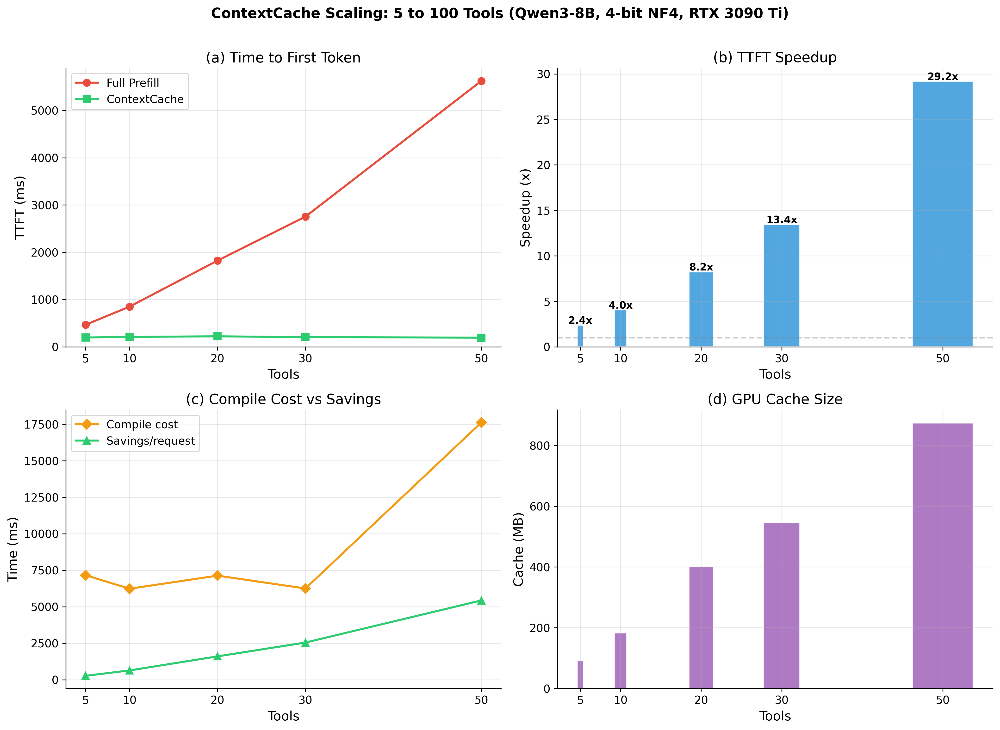

# ContextCache

[](https://ideacred.com/profile/spranab)

**Skip 99% of tool tokens. TTFT stays flat at 200ms.**

ContextCache is an open-source middleware that caches the KV states of tool definitions so they don't get recomputed on every request. Register your tools once, reuse the cached KV across all users, sessions, and requests.



| Tools | Full Prefill | Cached | Speedup | Tokens Skipped | Saved @10K req/day |
|------:|-------------:|-------:|--------:|---------------:|-------------------:|
|     5 |       466 ms | 196 ms |    2.4x |      651 (89%) |               6.5M |
|    10 |       850 ms | 210 ms |    4.0x |    1,303 (94%) |              13.0M |
|    20 |     1,823 ms | 221 ms |    8.2x |    2,854 (97%) |              28.5M |
|    30 |     2,754 ms | 205 ms |   13.4x |    3,884 (98%) |              38.8M |
|    50 |     5,625 ms | 193 ms |   29.2x |    6,215 (99%) |              62.1M |

*Qwen3-8B | 4-bit NF4 | RTX 3090 Ti | 15 queries per size*

## Why?

Every tool-calling LLM request sends the full tool schemas through prefill. With 50 tools that's ~6,000 tokens reprocessed on every single request, for every user, even though the tools never change.

ContextCache compiles those tool schemas into a KV cache **once**, stores it on disk, and reuses it across all requests. Only the user query (a few tokens) goes through prefill. The result: **constant ~200ms TTFT regardless of how many tools you have.**

## Quick Start

```bash
git clone https://github.com/spranab/contextcache.git
cd contextcache

# Demo mode (no GPU needed)
./start.sh

# Live mode (requires GPU with ~8GB VRAM)
./start.sh --live
```

Open http://localhost:8421 for the browser dashboard.

### Python SDK

```bash
pip install contextcache
```

```python
from contextcache import ContextCacheClient

client = ContextCacheClient("http://localhost:8421", api_key="your-key")

# Register tools (compiles KV cache — one time cost)
client.register_tools("merchant", tools=[
    {"type": "function", "function": {"name": "gmv_summary", ...}},
    {"type": "function", "function": {"name": "track_order", ...}},
    # ... up to 100+ tools
])

# Route queries — cache hit, ~200ms regardless of tool count
result = client.route("merchant", "What's my GMV for last 30 days?")
print(result.tool_name)    # "gmv_summary"
print(result.arguments)    # {"time_period": "last_30_days"}
print(result.confidence)   # 1.0

# Full pipeline: route → execute → call Claude/GPT for final answer
result = client.pipeline(
    "merchant", "What's my GMV?",
    llm_format="claude",
    llm_api_key="sk-ant-...",
)
print(result.llm_response)  # "Your GMV for the last 30 days is $1.2M..."
```

### Server-Side LLM Credentials

Keep API keys off the wire — configure once on the server:

```bash
python scripts/serve/serve_context_cache.py --llm-config configs/llm_config.json
```

```python
# Or configure via API
client.configure_llm("merchant", provider="claude", api_key="sk-ant-...")

# Now pipeline calls don't need API keys
result = client.pipeline("merchant", "What's my GMV?")
print(result.llm_response)  # Claude answers automatically
```

## How It Works

```
Tool Schemas (JSON) ──→ SHA-256 hash ──→ Group KV Compilation
                                              │
                                         Store to disk (.pt files)
                                              │
Request: "What's my GMV?" ──→ Load cached KV ──→ Suffix-only prefill ──→ Tool selection
                                                     (only user query)
```

**Group caching**: System prompt + all tool definitions are compiled together into a single KV cache blob, keyed by SHA-256 hash of the sorted schemas. On cache hit, only the user query suffix goes through the model.

**Content-addressed storage**: Identical tool sets across tenants share the same cache automatically. No duplicate computation, no duplicate storage.

**Why not per-tool caching?** Per-tool independent KV compilation fails (TSA ~0.1) because tool tokens need cross-attention to the system prompt and each other during prefill. Group caching preserves these dependencies and matches full prefill quality exactly.

### Quality: Zero Degradation

| Split | Condition | TSA | PF1 | EM |
|-------|-----------|-----|-----|----|
| test_seen | group_cached | **0.850** | 0.735 | 0.600 |
| test_seen | full_prefill | 0.850 | 0.716 | 0.550 |
| test_held_out | group_cached | **0.900** | 0.694 | 0.600 |
| test_held_out | full_prefill | 0.900 | 0.694 | 0.600 |
| test_unseen | group_cached | **0.850** | 0.676 | 0.550 |
| test_unseen | full_prefill | 0.850 | 0.676 | 0.550 |

Group-cached matches full prefill **exactly** on TSA across all 3 splits.

## API Reference

### V2 Endpoints (Multi-Tenant)

| Endpoint | Method | Description |
|----------|--------|-------------|
| `/v2/tools` | POST | Register a named tool set (tool_id) |
| `/route` | POST | Route query → tool selection with confidence |
| `/v2/pipeline` | POST | Full pipeline: route → execute → format → LLM call |
| `/v2/registry` | GET | List all registered tool sets |
| `/v2/tools/{tool_id}` | DELETE | Remove a tool set |

### V1 Endpoints (Single-Tenant, Backward Compatible)

| Endpoint | Method | Description |
|----------|--------|-------------|
| `/tools` | POST | Register tool schemas |
| `/query` | POST | Query with cached context |
| `/query/compare` | POST | A/B: cached vs full prefill |
| `/status` | GET | Cache stats |
| `/health` | GET | Health check |

### Admin Endpoints

| Endpoint | Method | Description |
|----------|--------|-------------|
| `/admin/llm-config/{tool_id}` | POST | Set server-side LLM credentials |
| `/admin/llm-config` | GET | List LLM configs (keys masked) |
| `/admin/metrics` | GET | Per-key request metrics |
| `/admin/memory` | GET | GPU cache memory status |
| `/admin/evict` | POST | Force LRU eviction |

## Architecture

```
contextcache/
  context_cache/                     # Core package
    context_cache.py                 # KV cache engine (compile, link, execute)
    client.py                        # Python SDK (ContextCacheClient)
    orchestrator.py                  # Confidence-gated pipeline coordinator
    tool_router.py                   # Async tool router with KV state caching
    llama_cpp_engine.py              # ctypes wrapper for llama.cpp (CPU inference)
    llm_adapter.py                   # Claude/OpenAI adapters (enterprise gateway support)
    llm_config.py                    # Server-side LLM credential management
    middleware.py                    # Auth, rate limiting, metrics
    memory_manager.py                # GPU memory tracking, LRU eviction
    cache_config.py                  # Configuration dataclasses
    kv_store.py                      # Persistent hash-addressed KV store
    model_adapter.py                 # Model-agnostic adapter (Qwen, Llama, etc.)
    rope_utils.py                    # RoPE math utilities
  scripts/
    serve/serve_context_cache.py     # FastAPI server (GPU context cache)
    serve/serve_orchestrator.py      # FastAPI server (CPU orchestrator)
    serve/static/index.html          # Context cache dashboard
    serve/static/orchestrator.html   # Orchestrator admin UI
    eval/test_accuracy.py            # Routing accuracy benchmark
    cache/benchmark_scaling_100.py   # Scaling benchmark (5→100 tools)
    analysis/scaling_charts.py       # Generate charts
  examples/
    retail_assistant.py              # Interactive CLI demo app
    fastapi_integration.py           # FastAPI wrapper pattern
  tests/                             # 130 unit tests
  configs/
    context_cache_config.yaml        # GPU context cache config
    orchestrator_config.yaml         # CPU orchestrator config
    llm_config.example.json          # Example server-side LLM config
```

## Benchmarks

```bash
# Scaling benchmark (requires CUDA GPU)
python scripts/cache/benchmark_scaling_100.py

# Routing accuracy test
python scripts/eval/test_accuracy.py --num-tools 50

# Unit tests (no GPU needed)
pip install -e ".[dev]"
pytest tests/ -v
```

---

## Choosing Your Setup: GPU vs CPU

ContextCache offers two inference backends. Both cache tool schemas as KV states for fast routing — the difference is the model runtime and hardware requirements.

| | GPU Context Cache | CPU Orchestrator |
|--|-------------------|------------------|
| **Server** | `serve_context_cache.py` (port 8421) | `serve_orchestrator.py` (port 8422) |
| **Runtime** | PyTorch + transformers | llama.cpp (ctypes) |
| **Model** | Qwen3-8B, 4-bit NF4 | Qwen3.5-2B, 4-bit GGUF |
| **Hardware** | NVIDIA GPU (~8GB VRAM) | Any CPU (4+ threads) |
| **Route latency** | ~200ms (50 tools) | ~550ms (50 tools) |
| **Speedup** | 29.2x over full prefill | ~10x over cold prefill |
| **Cache storage** | Disk (SHA-256 content-addressed) | In-memory (per-domain) |
| **Persistence** | Survives restarts (.pt files) | Lost on restart (use preload_domains) |
| **Param extraction** | Built-in (same model) | External LLM (Ollama/Claude/OpenAI) |
| **Quality (TSA)** | 0.850 (zero degradation) | 0.95-1.00 accuracy |

**Choose GPU** if you have a CUDA GPU, need the fastest routing (~200ms), want persistent disk caching across restarts, or need the full NoPE RoPE research pipeline.

**Choose CPU** if you don't have a GPU, want a simpler setup, are OK with ~550ms routing, or prefer using an external LLM (Claude/OpenAI) for synthesis instead of the local model.

Both systems use the same tool schema format (OpenAI function-calling) and can run side-by-side on different ports.

---

## CPU Orchestrator (No GPU Required)

The orchestrator is a standalone service that uses a small local model (Qwen3.5-2B, 4-bit GGUF) for fast tool routing on CPU, with an external LLM (Ollama, Claude, OpenAI) for parameter extraction and response synthesis. Two products from one server:

| Product | Endpoint | What it does | Latency | LLM needed? |
|---------|----------|-------------|---------|-------------|
| **Route-Only** | `POST /route` | Tool detection + confidence | ~500ms | No |
| **Full Pipeline** | `POST /query` | Route → extract params → execute → synthesize | ~3s | Yes |

### Quick Start (Orchestrator)

```bash
# 1. Download the routing model (~1.5GB)
pip install huggingface-hub
huggingface-cli download unsloth/Qwen3.5-2B-GGUF Qwen3.5-2B-Q4_K_M.gguf

# 2. Edit the model path in the config
#    Set router.model_path to where the GGUF file was downloaded
nano configs/orchestrator_config.yaml

# 3. Start the orchestrator server
python scripts/serve/serve_orchestrator.py --config configs/orchestrator_config.yaml

# 4. Open the admin UI
#    http://localhost:8422
```

### Domains and Tool Registration

A **domain** is a named group of tools that share a cached KV state. You register tools under a domain ID (any string you choose — e.g., `retail`, `support`, `merchant`), and all queries to that domain route against those tools.

```
POST /domains/{domain_id}/tools
```

**Tool schema format** — standard OpenAI function-calling format:

```json
{
  "tools": [
    {
      "type": "function",
      "function": {
        "name": "search_products",
        "description": "Search the product catalog by keyword, category, or price range",
        "parameters": {
          "type": "object",
          "properties": {
            "query": {"type": "string", "description": "Search keywords"},
            "max_price": {"type": "number", "description": "Maximum price filter"},
            "category": {"type": "string", "description": "Product category"}
          },
          "required": ["query"]
        }
      }
    }
  ]
}
```

Registration triggers a cold prefill of all tool schemas into the local model's KV cache. This is a one-time cost:

| Tools | Prefill Time | State Size |
|------:|-------------:|-----------:|
|     4 |        ~3.5s |      ~24MB |
|    20 |       ~22s   |      ~24MB |
|    50 |      ~44-106s|      ~24MB |

After registration, every query to that domain restores the cached state (~50ms) instead of re-prefilling all schemas.

**Domain lifecycle:**

```
Register tools → Cached KV state → Route queries → (optional) Remove domain
     POST           in-memory           POST /route         DELETE
  /domains/X/tools                     POST /query      /domains/X
```

- Domains live in memory (not persisted to disk across server restarts)
- Use `preload_domains` in config YAML to auto-register at startup
- Maximum domains configurable via `router.max_domains` (default: 20, LRU eviction)

**Domain vs Group Key:** The orchestrator's `domain_id` is a user-facing name. The original GPU-based context cache (`context_cache.py`) uses a `group_key` — a SHA-256 hash of sorted tool schemas — for content-addressed disk storage. These are separate systems; domains are not persisted to the hash-addressed KV store.

### Route-Only Product

For teams that have their own LLM pipeline and just need fast tool routing:

```bash
# Route a query (no LLM needed)
curl -X POST http://localhost:8422/route \
  -H "Content-Type: application/json" \
  -d '{
    "domain_id": "retail",
    "query": "Do we have iPhone 16 Pro in stock?",
    "include_schema": true
  }'
```

Response:
```json
{
  "tool_name": "check_inventory",
  "confidence": 0.984,
  "top_candidates": [
    {"name": "check_inventory", "probability": 0.984},
    {"name": "search_products", "probability": 0.012}
  ],
  "tool_schema": { "type": "function", "function": { "name": "check_inventory", ... } },
  "timings": { "route_ms": 552, "restore_ms": 48, "prefill_ms": 480, "gen_ms": 24 }
}
```

Set `include_schema: true` to get the matched tool's full schema back — useful for passing to your own LLM for param extraction.

### Full Pipeline Product

End-to-end orchestration with any OpenAI-compatible LLM (Ollama, Claude, OpenAI, etc.):

```bash
curl -X POST http://localhost:8422/query \
  -H "Content-Type: application/json" \
  -d '{
    "domain_id": "retail",
    "query": "Apply a 15% discount to order ORD-5678",
    "llm_base_url": "http://localhost:11434/v1",
    "llm_model": "qwen3.5:9b",
    "llm_api_key": "ollama",
    "llm_provider": "openai"
  }'
```

The pipeline:
1. **Route** (~500ms) — local 2B model selects the tool from cached KV state
2. **Confidence gate** — HIGH (≥0.7): proceed, LOW (0.2-0.7): proceed with caution, NO_TOOL (<0.2): conversational response
3. **Param extraction** (~1s) — external LLM extracts params from a minimal prompt (just param names/types, not full schema)
4. **Execute** — call the tool executor (mock, HTTP URL, or callable)
5. **Synthesis** (~1-2s) — external LLM generates a user-friendly response from the tool result

The external LLM never sees the full tool catalog. At most it sees one tool's parameter names during extraction.

### Thinking Mode

Enable LLM reasoning for deeper analysis on complex queries. Only applies to synthesis (param extraction always uses fast mode):

```bash
# Per-request
curl -X POST http://localhost:8422/query \
  -d '{ ..., "enable_thinking": true }'

# Server-wide default in orchestrator_config.yaml
orchestrator:
  enable_thinking: true
```

| Mode | Synthesis Latency | Quality |
|------|------------------|---------|
| Thinking OFF | ~1-2s | Good for straightforward queries |
| Thinking ON  | ~5-34s | Better for complex analysis, reasoning trace returned |

When enabled, the response includes a `thinking` field with the LLM's reasoning trace.

### Admin Web UI

Open `http://localhost:8422` for the browser-based admin panel:

- **Domains** — Register tool catalogs (paste JSON), view/remove domains
- **Route** — Test single queries, view confidence scores, batch testing
- **Pipeline** — Full query with LLM config, thinking toggle, step-by-step timing breakdown
- **History** — Session query history with metadata

### Orchestrator API Reference

| Endpoint | Method | Description |
|----------|--------|-------------|
| `/domains/{domain_id}/tools` | POST | Register a tool catalog (cold prefill) |
| `/route` | POST | Route-only: tool name + confidence (~500ms) |
| `/query` | POST | Full pipeline: route → params → execute → synthesize |
| `/domains` | GET | List all registered domains |
| `/domains/{domain_id}` | DELETE | Remove a domain |
| `/health` | GET | Health check |
| `/admin/llm-config/{domain_id}` | POST | Set server-side LLM credentials |
| `/admin/llm-config` | GET | List LLM configs (keys masked) |
| `/admin/llm-config/{domain_id}` | DELETE | Remove LLM config |
| `/admin/metrics` | GET | Per-key request metrics (requires `--auth`) |
| `/` | GET | Admin web UI |

### Orchestrator Configuration

`configs/orchestrator_config.yaml`:

```yaml
router:
  model_path: "/path/to/Qwen3.5-2B-Q4_K_M.gguf"  # GGUF model file
  n_ctx: 16384          # Context window (tokens)
  n_threads: 4          # CPU threads for inference
  n_batch: 2048         # Batch size for prefill
  max_domains: 20       # Max cached domains (LRU eviction)

orchestrator:
  high_confidence_threshold: 0.7    # >= this: execute tool directly
  low_confidence_threshold: 0.2     # < this: skip tool, conversational response
  max_tool_calls: 10                # Safety limit per request
  timeout_s: 120.0                  # Overall timeout per request
  synthesis_temperature: 0.3        # Creativity in final response
  max_synthesis_tokens: 1024        # Max tokens for final response
  enable_thinking: false            # LLM thinking mode (slower but deeper)

# Pre-register domains at startup
preload_domains:
  - domain_id: retail
    tools_path: scripts/cache/retail_tools.json

# Server binding
host: "0.0.0.0"
port: 8422
```

**LLM credentials** can be provided per-request, per-domain (via `/admin/llm-config`), or server-wide via environment variables:

```bash
export CONTEXTCACHE_LLM_PROVIDER=openai
export CONTEXTCACHE_LLM_API_KEY=sk-...
export CONTEXTCACHE_LLM_MODEL=gpt-4o
export CONTEXTCACHE_LLM_BASE_URL=http://localhost:11434/v1  # for Ollama
```

### Model Size Guide

| Model | Speed | Accuracy | Use Case |
|-------|-------|----------|----------|
| Qwen3.5-0.8B | ~400ms | 80-85% | Prototype, low-resource |
| Qwen3.5-2B | ~550ms | 95-100% | Production (recommended) |
| Qwen3.5-4B | ~800ms | Highest | Maximum accuracy |

All models run on CPU with 4-bit quantization (GGUF Q4_K_M). No GPU required.

### End-to-End Guide: From Tool Registration to Consumer App

This walkthrough shows the complete lifecycle: setting up the server, registering tools, and consuming the API from your own application.

#### Step 1: Start the Orchestrator

```bash
# Terminal 1: Start the orchestrator server
python scripts/serve/serve_orchestrator.py --config configs/orchestrator_config.yaml
# Server starts on http://localhost:8422, loads the 2B routing model (~3s)
```

If using the full pipeline (not just route-only), also start Ollama:

```bash
# Terminal 2: Start Ollama with a model
ollama pull qwen3.5:4b
ollama serve  # Runs on http://localhost:11434
```

#### Step 2: Register Your Tool Catalog

Define your tools in OpenAI function-calling format and POST them to a domain:

```bash
curl -X POST http://localhost:8422/domains/retail/tools \
  -H "Content-Type: application/json" \
  -d '{
    "tools": [
      {
        "type": "function",
        "function": {
          "name": "check_inventory",
          "description": "Check product inventory levels by SKU or product name",
          "parameters": {
            "type": "object",
            "properties": {
              "product": {"type": "string", "description": "Product name or SKU"}
            },
            "required": ["product"]
          }
        }
      },
      {
        "type": "function",
        "function": {
          "name": "get_order_status",
          "description": "Get the current status of a customer order by order ID",
          "parameters": {
            "type": "object",
            "properties": {
              "order_id": {"type": "string", "description": "The order ID to look up"}
            },
            "required": ["order_id"]
          }
        }
      }
    ]
  }'
```

Response:
```json
{
  "status": "registered",
  "domain_id": "retail",
  "num_tools": 2,
  "prefix_tokens": 312,
  "state_size_mb": 24.1,
  "prefill_ms": 1850
}
```

This cold prefill is a one-time cost. All subsequent queries restore the cached KV state in ~50ms.

Alternatively, register tools via the **admin UI** at `http://localhost:8422` — paste your JSON in the Domains tab.

#### Step 3: Query from Your App

**Option A — Route-only (no LLM needed):**

Your app gets the tool name + confidence, then handles params and execution itself.

```python
import requests

resp = requests.post("http://localhost:8422/route", json={
    "domain_id": "retail",
    "query": "Do we have iPhone 16 Pro in stock?",
    "include_schema": True,    # Get the matched tool's schema back
})
data = resp.json()

print(data["tool_name"])       # "check_inventory"
print(data["confidence"])      # 0.984
print(data["tool_schema"])     # Full schema for your own LLM to extract params
print(data["timings"])         # {"route_ms": 552, "restore_ms": 48, ...}
```

**Option B — Full pipeline (with LLM):**

The orchestrator handles everything: routing, param extraction, tool execution, and synthesis.

```python
resp = requests.post("http://localhost:8422/query", json={
    "domain_id": "retail",
    "query": "Do we have iPhone 16 Pro in stock?",
    "tool_executor": "mock",   # Or an HTTP URL to your real tool backend
    "llm_provider": "openai",
    "llm_api_key": "ollama",   # "ollama" for local, real key for Claude/OpenAI
    "llm_model": "qwen3.5:4b",
    "llm_base_url": "http://localhost:11434/v1",
})
data = resp.json()

print(data["final_response"])  # "Based on our inventory check, we currently..."
print(data["tool_calls"][0])   # {"tool_name": "check_inventory", "arguments": {"product": "iPhone 16 Pro"}, ...}
print(data["confidence"])      # 0.984
print(data["timings"])         # {"route_ms": 550, "param_extraction_ms": 980, "synthesis_ms": 1200, ...}
```

**Option C — Using Claude or OpenAI as the LLM:**

```python
# Claude
resp = requests.post("http://localhost:8422/query", json={
    "domain_id": "retail",
    "query": "Check inventory for iPhone 16 Pro",
    "llm_provider": "claude",
    "llm_api_key": "sk-ant-api03-...",
    "llm_model": "claude-sonnet-4-20250514",
})

# OpenAI
resp = requests.post("http://localhost:8422/query", json={
    "domain_id": "retail",
    "query": "Check inventory for iPhone 16 Pro",
    "llm_provider": "openai",
    "llm_api_key": "sk-...",
    "llm_model": "gpt-4o",
})
```

#### Step 4: Connect Real Tool Execution

By default, `tool_executor: "mock"` returns simulated results. To connect real tools, point it at your tool backend:

```python
# Your tools backend handles POST with {"tool": "check_inventory", "arguments": {"product": "..."}}
resp = requests.post("http://localhost:8422/query", json={
    "domain_id": "retail",
    "query": "Check inventory for iPhone 16 Pro",
    "tool_executor": "http://localhost:5000/execute",  # Your tool backend URL
    "llm_provider": "openai",
    "llm_api_key": "ollama",
    "llm_model": "qwen3.5:4b",
    "llm_base_url": "http://localhost:11434/v1",
})
```

Your tool backend receives:
```json
{"tool": "check_inventory", "arguments": {"product": "iPhone 16 Pro"}}
```

And should return a JSON result:
```json
{"status": "in_stock", "quantity": 45, "warehouse": "US-West"}
```

The orchestrator passes this result to the LLM for synthesis.

#### Step 5: Server-Side LLM Credentials (Production)

Instead of passing API keys per-request, configure them once on the server:

```bash
# Set credentials for a specific domain
curl -X POST http://localhost:8422/admin/llm-config/retail \
  -H "Content-Type: application/json" \
  -d '{"provider": "claude", "api_key": "sk-ant-...", "model": "claude-sonnet-4-20250514"}'

# Set global default (used when no domain-specific config exists)
curl -X POST http://localhost:8422/admin/llm-config/_default \
  -H "Content-Type: application/json" \
  -d '{"provider": "openai", "api_key": "sk-...", "model": "gpt-4o"}'
```

Now queries don't need LLM credentials:
```python
resp = requests.post("http://localhost:8422/query", json={
    "domain_id": "retail",
    "query": "Check inventory for iPhone 16 Pro",
})
# Uses server-configured Claude credentials automatically
```

### Demo Apps

Working examples in [`examples/`](examples/):

| Example | Description |
|---------|-------------|
| [`retail_assistant.py`](examples/retail_assistant.py) | Interactive CLI chatbot. Registers tools, routes queries, supports route-only and full pipeline modes. |
| [`fastapi_integration.py`](examples/fastapi_integration.py) | FastAPI app that wraps the orchestrator as a backend. Shows the `Your App -> Orchestrator -> Tools + LLM` pattern. |

```bash
# Interactive retail assistant (route-only, no LLM needed)
python examples/retail_assistant.py --route-only

# Interactive with full LLM pipeline
python examples/retail_assistant.py --llm-model qwen3.5:4b

# Run demo queries and exit
python examples/retail_assistant.py --demo

# FastAPI wrapper (serves on http://localhost:8000)
python examples/fastapi_integration.py
```

### Supported LLM Providers

The orchestrator's full pipeline needs an external LLM for parameter extraction and response synthesis. Any provider that speaks the OpenAI Chat Completions API works out of the box via `base_url`:

| Provider | `llm_provider` | `llm_base_url` | `llm_api_key` | `llm_model` |
|----------|---------------|-----------------|---------------|-------------|
| **Ollama** (local) | `openai` | `http://localhost:11434/v1` | `ollama` | `qwen3.5:4b` |
| **OpenAI** | `openai` | *(default)* | `sk-...` | `gpt-4o` |
| **Claude** | `claude` | *(default)* | `sk-ant-...` | `claude-sonnet-4-20250514` |
| **xAI (Grok)** | `openai` | `https://api.x.ai/v1` | `xai-...` | `grok-3` |
| **DeepSeek** | `openai` | `https://api.deepseek.com/v1` | `sk-...` | `deepseek-chat` |
| **Groq** | `openai` | `https://api.groq.com/openai/v1` | `gsk_...` | `llama-3.3-70b-versatile` |
| **Together AI** | `openai` | `https://api.together.xyz/v1` | `tog-...` | `meta-llama/Llama-3-70b-chat-hf` |
| **Fireworks** | `openai` | `https://api.fireworks.ai/inference/v1` | `fw_...` | `accounts/fireworks/models/llama-v3p1-70b-instruct` |
| **Azure OpenAI** | `openai` | `https://YOUR.openai.azure.com/openai/deployments/YOUR-DEPLOYMENT/chat/completions?api-version=2024-02-01` | `your-key` | `gpt-4o` |
| **vLLM** (self-hosted) | `openai` | `http://localhost:8000/v1` | `token` | `your-model` |

**The pattern:** anything OpenAI-compatible uses `llm_provider: "openai"` with a custom `base_url`. Only Claude uses its own provider (`claude`) because it has a different message format (tool_use blocks instead of tool_calls).

**AWS Bedrock / Google Vertex:** These use proprietary auth (SigV4 / OAuth) that doesn't fit standard Bearer token auth. Use a proxy like [LiteLLM](https://github.com/BerriAI/litellm) to expose them as OpenAI-compatible endpoints:

```bash
# LiteLLM proxy for Bedrock
pip install litellm
litellm --model bedrock/anthropic.claude-3-sonnet-20240229-v1:0

# Then point ContextCache at it
"llm_provider": "openai",
"llm_base_url": "http://localhost:4000/v1",
"llm_api_key": "anything"
```

For **enterprise gateways** that need custom headers (API management platforms, internal proxies), use the `extra_headers` parameter in server-side LLM config or pass headers via the admin API.

---

## Enterprise Features

- **Multi-tenant**: Multiple tool sets with independent caches, LRU eviction
- **LLM Pipeline**: Route → execute → call Claude/OpenAI for final answer
- **Enterprise gateways**: Custom `base_url` + `extra_headers` for Azure OpenAI, internal proxies, etc.
- **Server-side credentials**: API keys stored on server, never sent in requests
- **Auth & rate limiting**: API key validation, per-key sliding window rate limits
- **Metrics**: Per-key request counts, latencies, cache hit rates
- **Persistent cache**: Disk-backed KV store survives server restarts

## Paper

**ContextCache: Persistent KV Cache with Content-Hash Addressing for Zero-Degradation Tool Schema Caching**
Pranab Sarkar, 2026

Paper PDF: [paper/main.pdf](paper/main.pdf)

[](https://doi.org/10.5281/zenodo.18795189)

## Citation

```bibtex
@techreport{sarkar2026contextcache,
  title={ContextCache: Persistent {KV} Cache with Content-Hash Addressing for Zero-Degradation Tool Schema Caching},
  author={Sarkar, Pranab},
  year={2026},
  institution={Zenodo},
  doi={10.5281/zenodo.18795189},
  url={https://doi.org/10.5281/zenodo.18795189}
}
```

## License

This work is licensed under [CC BY 4.0](https://creativecommons.org/licenses/by/4.0/).
